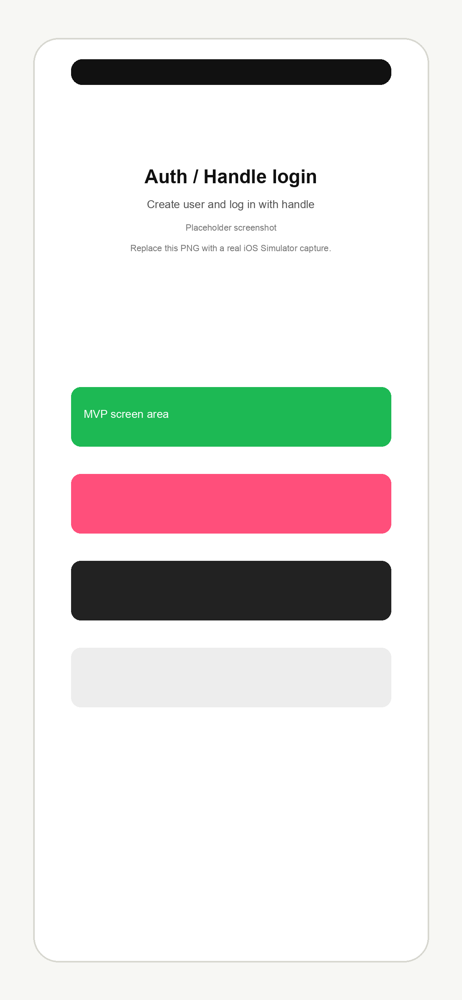
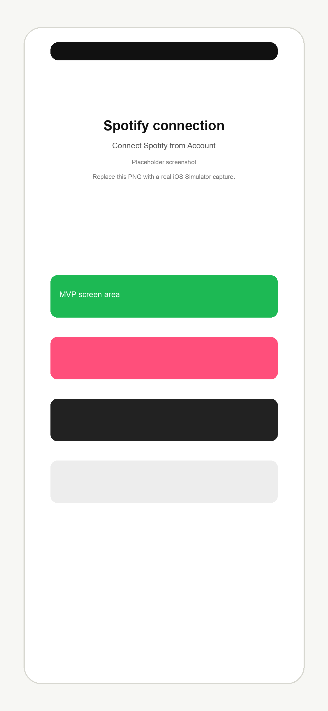
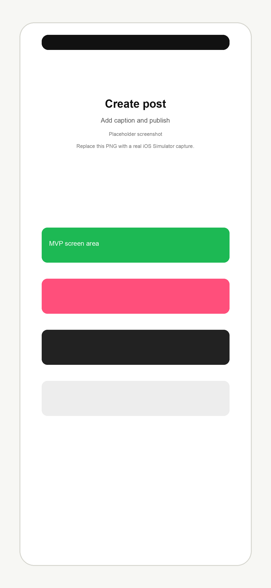
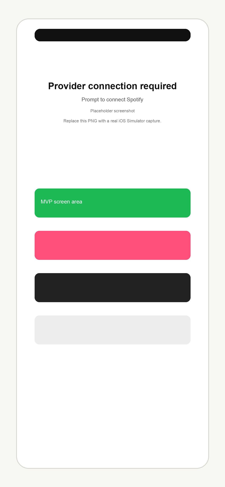

# Cross-Subscription Music Timeline

Apple Music と Spotify の間にある「共有しにくさ」を減らすための、iOS 重視の音楽投稿・試聴タイムラインアプリです。

ユーザーは好きな曲を紹介文付きで投稿できます。タイムラインでは投稿された音楽が並び、受け手は自分が利用しているサブスクリプションサービスで楽曲を開いたり、可能な範囲で試聴したりできます。現在のMVPでは、iOSアプリから認証、Spotify接続、曲検索、投稿作成、Timeline表示、preview再生、provider外部遷移までを確認できます。

## MVP Snapshot

- Apple Music / Spotify間で曲を共有しにくい課題に対し、providerをまたいだ音楽投稿Timelineを作る。
- `tracks` と `provider_tracks` を分離したcanonical track modelで、同一楽曲とprovider別メタデータを分けて扱う。
- iOSはSwiftUIで、BackendはFastAPI + PostgreSQL + SQLAlchemy + Alembicで構成する。
- BackendはDocker化し、AWS ECS Fargate / RDS PostgreSQL / Secrets Managerを前提に運用できる。
- Apple Developer Program未登録でも動くMVPとして、Apple MusicはMusicKit再生ではなく `provider_url` による外部遷移を中心にする。
- Spotifyは `preview_url` が存在する場合だけAVPlayerで30秒試聴できる。
- 音源ファイルは保存・再配布せず、Spotify / Apple Musicをスクレイピングしない。

## 概要

音楽配信サービスごとに、同じ楽曲であっても異なるIDが割り当てられます。

例えば、Spotify上のある曲とApple Music上の同じ曲は、それぞれ別のprovider track IDを持ちます。

このアプリでは、楽曲そのものを表す `tracks` と、Spotify / Apple Music 上の楽曲情報を表す `provider_tracks` を分離することで、異なるサービス上の同一楽曲をアプリケーション内で同じ楽曲として扱えるようにしています。

## 技術構成

- iOS: SwiftUI, AVPlayer
- Backend: FastAPI, SQLAlchemy, Alembic, PostgreSQL
- Auth: JWT
- Provider integration: Apple Music / Spotify adapter pattern
- Matching: ISRC 優先、曲名・アーティスト・アルバム・再生時間で補助
- Deploy: Docker + AWS ECS Fargate
- DB: Amazon RDS PostgreSQL
- Secrets: AWS Secrets Manager
- CI: GitHub Actions, Python, pytest, ruff

## Current MVP Status

現在のiOS MVPでは、Apple Developer Program登録なしで確認できる範囲を優先しています。

実装済み:

- iOS SwiftUIアプリからBackend `GET /posts` を呼び出し、Timelineを表示する。
- 投稿カードにartwork、title、artist、album、caption、providerを表示する。
- Spotify `preview_url` がある場合のみ、AVPlayerで30秒試聴できる。
- `provider_url` からSpotify / Apple MusicのアプリまたはWebへ外部遷移できる。
- 曲検索、playback metadata取得、caption付き投稿作成、投稿成功後のTimeline再取得ができる。
- ユーザー作成、handleによる開発用ログイン、JWT保存・復元、`GET /me` 検証、logoutができる。
- Account画面からSpotify接続MVPを実行できる。
- Spotify認可URLをSafariで開き、callback URLまたは `code` / `state` を手動入力して `POST /auth/spotify/connect` できる。
- Account画面にSpotify接続状態を表示する。
- Spotify未接続時は、検索・投稿画面から接続案内へ誘導する。

現在の方針:

- Spotify中心に、検索、投稿、preview再生、provider外部遷移までをMVPの主導線にする。
- Apple MusicはMusicKit再生をまだ使わず、`provider_url` による外部遷移を基本にする。
- Apple Developer Tokenはまだ扱わない。

## Screenshots

画像は `docs/images/` に配置します。実スクリーンショットがまだない場合でもREADMEが崩れないよう、同名のプレースホルダーPNGを置いています。実機またはSimulatorで撮影した画像に差し替えると、このセクションにそのまま反映されます。

| Auth / Handle login | Timeline |
| --- | --- |
|  |  |

| Spotify connection | Track search |
| --- | --- |
|  |  |

| Create post | Provider connection required |
| --- | --- |
|  |  |

## iOS MVP Demo Flow

1. Backendを起動する。
2. iOSアプリを起動する。
3. 未認証の場合はユーザーを作成する。
4. handleでdev loginする。
5. Account画面でSpotify接続を開始する。
6. Spotify認可URLをSafariで開く。
7. 認可後のcallback URL、または `code` / `state` をアプリに手動入力する。
8. 曲検索画面でSpotifyの曲を検索する。
9. 曲を選択し、caption付きで投稿する。
10. 投稿成功後、Timelineに投稿が表示される。
11. `preview_url` がある投稿は試聴できる。
12. `provider_url` からSpotifyまたはApple Musicを開ける。

## Local Backend Startup

```bash
cd backend/api
uvicorn app.main:app --host 0.0.0.0 --port 4000 --reload
```

初回やDB schema更新後は、事前にPostgreSQLとmigrationを準備します。

```bash
docker compose up -d postgres
cd backend/api
python -m venv .venv
source .venv/bin/activate
pip install -r requirements.txt
alembic upgrade head
```

## iOS Build

```bash
DEVELOPER_DIR=/Applications/Xcode.app/Contents/Developer \
xcodebuild -project apps/ios/MusicTimelineApp.xcodeproj \
  -target MusicTimelineApp \
  -sdk iphonesimulator \
  -quiet build
```

SimulatorではAPI base URLは `http://localhost:4000` を使います。実機では `apps/ios/MusicTimelineApp/Support/AppEnvironment.swift` の実機向けURL、またはSchemeの `API_BASE_URL` 環境変数を利用します。

## Checks

現在の確認結果:

- `ruff check .`: passed
- `pytest`: 150 passed
- `xcodebuild` app target: passed
- `xcodebuild` unit/UI test targets with Debug configuration: passed

## Known Limitations

- `/auth/dev-login` はMVP/開発用であり、本番認証ではない。
- 本格的なパスワード認証、OAuthログイン、token refreshは未対応。
- JWTはKeychainに保存する。既存のUserDefaults保存tokenは起動時にKeychainへ移行して削除する。
- Spotify OAuth callbackは手動入力方式。
- `ASWebAuthenticationSession` とカスタムURLスキーム callback は未対応。導入時はSpotify DashboardとBackend redirect URIの変更が必要。
- Provider接続状態は `GET /me/provider-accounts` で取得する。検索・投稿retry補助のため、一部UserDefaults同期は残している。
- Apple MusicのMusicKit再生は未対応。
- Apple Developer Tokenは未使用。
- Apple Musicは現時点では外部遷移中心。
- Apple Music provider検索・playback APIはBackend設定やApple Developer Tokenがないと利用できない。

## デプロイ状況

検証用のBackend APIを AWS ECS Fargate にデプロイ済みです。

```text
http://music-timeline-api-alb-904044250.us-east-1.elb.amazonaws.com
```

確認済み:

```bash
curl http://music-timeline-api-alb-904044250.us-east-1.elb.amazonaws.com/health
curl http://music-timeline-api-alb-904044250.us-east-1.elb.amazonaws.com/posts
```

期待値:

```json
{"status":"ok"}
{"items":[],"next_before":null}
```

AWS構成:

```text
Application Load Balancer
  -> ECS Fargate
  -> FastAPI container
  -> Amazon RDS PostgreSQL

Amazon ECR
AWS Secrets Manager
CloudWatch Logs
```

このURLは検証用です。HTTPS、独自ドメイン、GitHub Actionsによる自動デプロイは今後対応します。

運用メモ:

- AWS無料クレジットを利用し、ポートフォリオ確認用の環境として維持しています。
- AWS Budgets / Cost Explorer で月額コストを監視します。
- CloudWatch Logs は `/ecs/music-timeline-api` に出力し、保持期間を 7 日に設定しています。
- 不要な ECR image や Security Group rule は定期的に整理します。
- 課金を抑えたい場合は、ECS service の desired count を 0 にしてAPIを停止できます。

## 設計上の見どころ

- `tracks` と `provider_tracks` を分離し、同一楽曲をサービス横断で扱う
- `posts` は canonical `track_id` と投稿元の `source_provider_track_id` を保持する
- Apple Music / Spotify は adapter pattern で抽象化する
- Provider token は暗号化保存を前提とする
- DB schema は Alembic migration で管理する
- pytest / ruff による継続的な検証を行う
- AWS ECS Fargate / RDS / Secrets Manager を前提にした構成へ整理する

## プロダクトの核

このアプリの価値は、単なる音楽 SNS ではなく、**サービスをまたいだ音楽共有・試聴体験**にあります。

例:

- Spotify ユーザーが楽曲を投稿する。
- Apple Music ユーザーがその投稿を見る。
- API が ISRC や曲名・アーティスト名を使って、サービス横断で同じ曲として扱えるようにする。
- Apple Music ユーザーは自分のサービス上で曲を開いたり、タイムライン上で試聴したりできる。

## 投稿と再生情報の流れ

投稿前に、クライアントは対象プロバイダーの楽曲再生情報を取得します。

```text
GET /providers/{provider}/tracks/{track_id}/playback
```

バックエンドはprovider APIから取得した情報をもとに、以下を保存します。

```text
tracks
  楽曲そのもの

provider_tracks
  Spotify / Apple Music 上の楽曲情報
```

その後、クライアントは投稿を作成します。

```text
POST /posts
```

リクエスト例:

```json
{
  "provider": "spotify",
  "provider_track_id": "spotify-track-1",
  "caption": "Great track"
}
```

バックエンドは `provider/provider_track_id` から `provider_tracks` を解決し、投稿には以下を保存します。

```text
posts.track_id
posts.source_provider_track_id
```

これにより、投稿は楽曲そのものを表す canonical `track_id` と、投稿元サービス上の楽曲情報を同時に参照できます。

## やらないこと

著作権と各サービスの規約を守るため、以下は明確に対象外です。

- 音源ファイルを生成、保存、アップロード、再配布しない。
- Spotify や Apple Music をスクレイピングしない。
- Spotify の 30 秒 preview URL のみを前提にした恒久的な再生設計にしない。
- 歌詞全文を投稿・保存しない。
- Spotify Content や Apple Music 由来のコンテンツを AI モデル学習に使わない。
- Apple、Apple Music、Spotify、アーティスト、レーベルから公認されたように見せない。

## リポジトリ構成

```text
apps/ios/              SwiftUI iOS MVP
backend/api/           FastAPI + SQLAlchemy + Alembic API
docs/                  requirements, database design, API spec
.github/workflows/     CI
docker-compose.yml     local PostgreSQL definition
```

## ローカル開発

PostgreSQLを起動します。

```bash
docker compose up -d postgres
```

Backendを起動します。

```bash
cd backend/api
python -m venv .venv
source .venv/bin/activate
pip install -r requirements.txt
alembic upgrade head
uvicorn app.main:app --reload --host 0.0.0.0 --port 4000
```

ヘルスチェック:

```bash
curl http://127.0.0.1:4000/health
```

期待値:

```json
{
  "status": "ok"
}
```

## テスト

Backendのlintとテストを実行します。

```bash
cd backend/api
ruff check .
pytest
```

DBを使うテストはSQLiteのin-memory databaseを使います。

本番・ローカル実行はPostgreSQLを使い、schema変更はAlembic migrationで管理します。

## ドキュメント

- [要件定義](docs/product-requirements.md)
- [DB設計書](docs/database-design.md)
- [API仕様書](docs/api-spec.md)
- [iOS MVPデモ手順](docs/ios-mvp-demo.md)
- [ローカル開発手順](docs/local-development.md)
- [MVP提出前チェックリスト](docs/mvp-release-checklist.md)
- [AWS手動デプロイ手順](docs/aws-deployment.md)

## 現在の状態

- iOS は SwiftUI MVPとして、認証、Timeline、検索、投稿、Spotify接続導線を実装済み。
- Backend は FastAPI + SQLAlchemy + Alembic + PostgreSQL 構成へ移行済み。
- Backend は AWS ECS Fargate に手動デプロイ済み。
- ALB 経由で `/health` と `/posts` の動作を確認済み。
- RDS PostgreSQL に対して Alembic migration を適用済み。
- JWT認証、ユーザー作成、投稿API、Provider adapter、Spotify OAuth、Apple Music連携基盤を実装。
- handleによる開発用ログインAPI `/auth/dev-login` を実装。
- iOSからユーザー作成、dev login、JWT保存・復元、`/me` 検証、logoutが可能。
- iOSからSpotify接続MVP、曲検索、playback取得、caption付き投稿作成が可能。
- `tracks` / `provider_tracks` / `posts` による canonical track model を導入。
- タイムライン投稿に provider playback metadata を含める基盤を実装。
- pytest / ruff による検証を整備。
