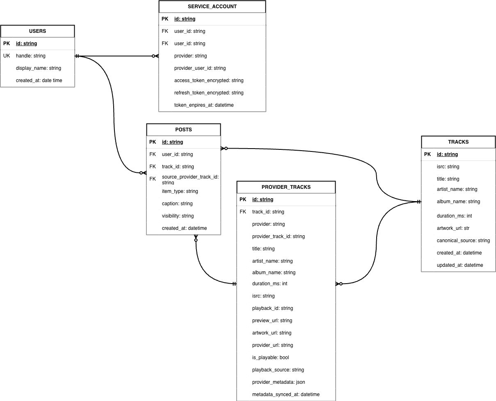
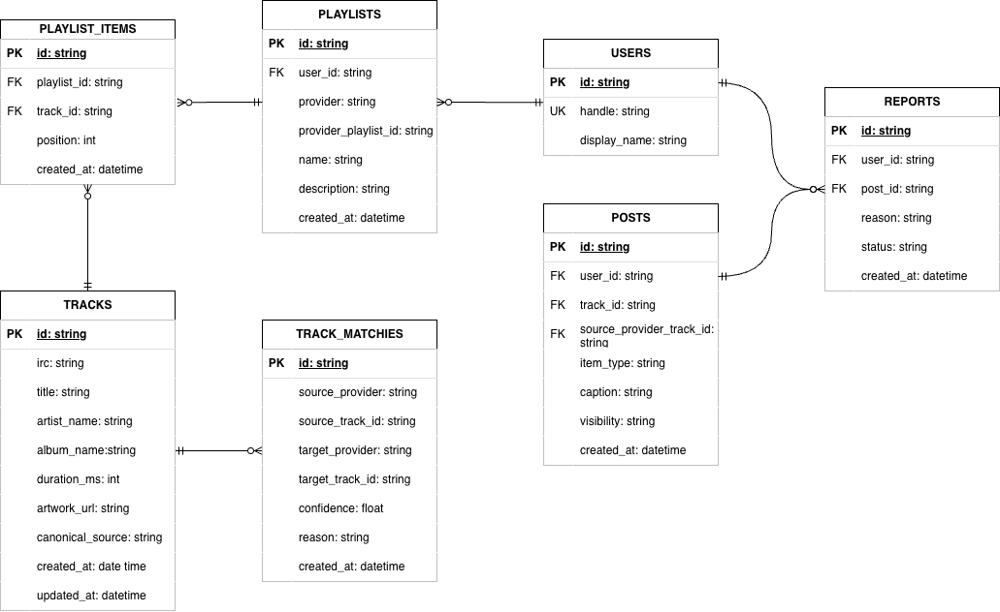

# DB設計書

## 方針

Spotify / Apple Music など異なる音楽サービス上の同一楽曲を、アプリケーション内では同じ楽曲として扱う。

そのため、楽曲そのものを表す `tracks` と、各プロバイダー上の楽曲情報を表す `provider_tracks` を分離する。

```text
tracks
  楽曲そのもの

provider_tracks
  Spotify / Apple Music 上の楽曲情報

posts
  タイムライン投稿
```

## ER図

コアドメイン:



周辺機能:



## 主要テーブル

### users

アプリケーションユーザー。

主なカラム:

- `id`
- `display_name`
- `handle`
- `primary_provider`
- `created_at`
- `updated_at`

制約:

- `handle` は unique

### service_accounts

ユーザーが連携した外部音楽サービスのアカウント。

主なカラム:

- `id`
- `user_id`
- `provider`
- `provider_user_id`
- `access_token`
- `refresh_token`
- `scope`
- `expires_at`
- `created_at`
- `updated_at`

制約:

- `(provider, provider_user_id)` は unique
- tokenは暗号化して保存する

### tracks

サービス横断で扱う canonical track。

主なカラム:

- `id`
- `isrc`
- `title`
- `artist_name`
- `album_name`
- `duration_ms`
- `artwork_url`
- `canonical_source`
- `created_at`
- `updated_at`

index:

- `isrc`

### provider_tracks

Spotify / Apple Music 上の楽曲情報。

主なカラム:

- `id`
- `track_id`
- `provider`
- `provider_track_id`
- `title`
- `artist_name`
- `album_name`
- `duration_ms`
- `isrc`
- `playback_id`
- `preview_url`
- `artwork_url`
- `provider_url`
- `is_playable`
- `playback_source`
- `provider_metadata`
- `metadata_synced_at`
- `created_at`
- `updated_at`

制約:

- `(provider, provider_track_id)` は unique

### posts

タイムライン投稿。

投稿は canonical `tracks` を参照しつつ、投稿元の `provider_tracks` も保持する。

主なカラム:

- `id`
- `user_id`
- `track_id`
- `source_provider_track_id`
- `item_type`
- `caption`
- `visibility`
- `created_at`

### reports

投稿や対象itemに対する通報。

主なカラム:

- `id`
- `reporter_user_id`
- `post_id`
- `reason`
- `status`
- `created_at`

### playlists / playlist_items

MVP後のプレイリスト拡張用テーブル。

`playlists` は外部Provider上のプレイリストを表し、`playlist_items` はプレイリスト内の楽曲を表す。

### track_matches

MVP後の高度なマッチング確認用テーブル。

現時点ではISRCとprovider track IDによる紐付けを優先し、曖昧な候補確認は将来拡張とする。

## テーブル関係

| 親 | 関係 | 子 | 意味 |
|---|---:|---|---|
| users | 1 -> N | service_accounts | 1人のユーザーは複数サービスと連携できる |
| users | 1 -> N | posts | 1人のユーザーは複数投稿を作成できる |
| users | 1 -> N | reports | 1人のユーザーは複数通報を作成できる |
| tracks | 1 -> N | provider_tracks | 1つの楽曲は複数サービス上の楽曲情報を持てる |
| tracks | 1 -> N | posts | 1つの楽曲は複数投稿から参照される |
| provider_tracks | 1 -> N | posts | 1つのprovider trackは複数投稿の投稿元になれる |
| posts | 1 -> N | reports | 1つの投稿は複数回通報される可能性がある |
| playlists | 1 -> N | playlist_items | 1つのプレイリストは複数曲を持つ |
| tracks | 1 -> N | playlist_items | 1つの楽曲は複数プレイリスト項目から参照される |

## 楽曲保存の流れ

Provider playback metadataを取得した時、Backendは以下の順で保存先を決める。

1. `(provider, provider_track_id)` で既存の `provider_tracks` を探す。
2. 存在すれば、その `track_id` を使う。
3. 存在しなければ、ISRCで既存の `tracks` を探す。
4. ISRCでも見つからなければ、新しい `tracks` を作成する。
5. `provider_tracks` を作成または更新する。

## 投稿保存の流れ

クライアントは `track_id` を直接送らず、以下を送る。

```json
{
  "provider": "spotify",
  "provider_track_id": "spotify-track-1",
  "caption": "Great track"
}
```

Backendは `provider_tracks` を解決し、投稿に以下を保存する。

```text
posts.track_id
posts.source_provider_track_id
```
